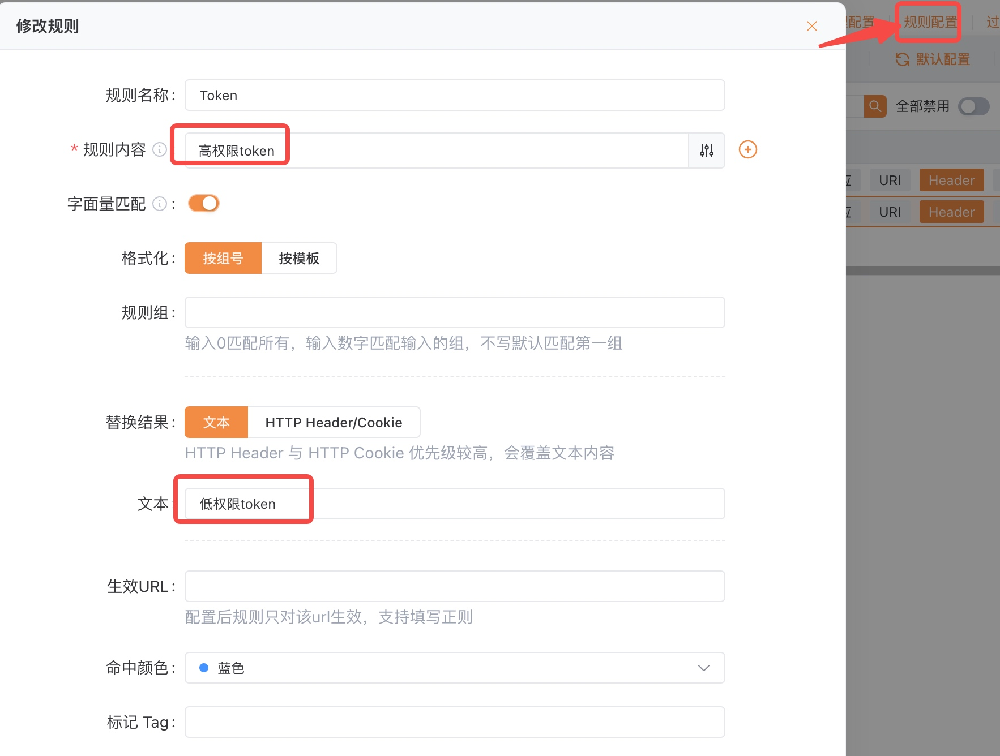
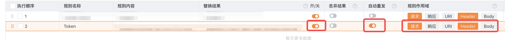
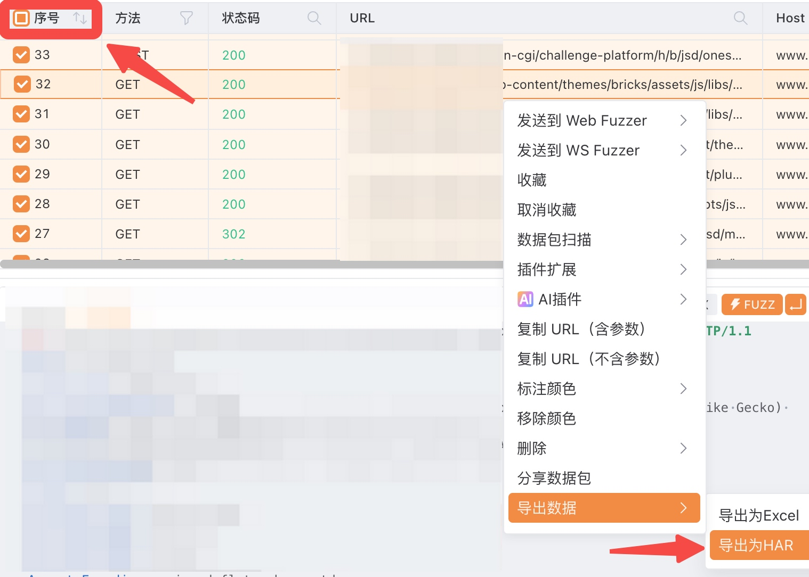
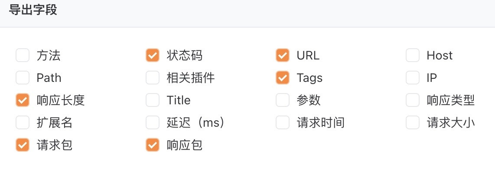

# Permission-Audit 越权识别工具

> 基于 YAKIT + AI 的垂直越权漏洞自动化检测方案

## 概述

**Permission-Audit** 是一款配合 [YAKIT](https://www.yaklang.io/) 使用的越权漏洞检测工具。通过分析 YAKIT 导出的 `.har` 文件，自动识别垂直越权行为（高权限接口被低权限用户访问），并结合 AI 进行深度危害评估。

## 工作流程

```
YAKIT 抓包 → 配置规则 → 遍历功能 → 导出 HAR → 分析脚本 → AI 评估 → 生成报告
```

## 前置准备

- [YAKIT](https://www.yaklang.io/) 已安装并配置好代理
- Python 3 环境
- Claude Code客户端 + DeepSeek（用于 AI 评估）（其他客户端也可以）

## YAKIT 配置步骤

代理设置完成后，按以下步骤操作：

### 1️⃣ 规则配置

在 YAKIT 中配置越权检测规则：

| 配置项 | 截图 |
|--------|------|
| 规则配置 |  |
| 详细规则 |  |

### 2️⃣ 导出 HAR 文件

遍历被测系统的所有功能模块，然后：

1. 点击序号列选中所有请求包
2. 右键 → **导出为 HAR**
3. 保存为 `.har` 文件

| 步骤 | 截图 |
|------|------|
| 选中请求包 |  |
| 导出 HAR |  |

### 3️⃣ AI 分析

将导出的 HAR 文件通过 Claude Code 配合 Permission-Audit Skill 进行分析判断：


## 分析能力

### 支持的漏洞类型

- ✅ **垂直越权** — 低权限用户访问高权限接口（当前版本）

### 渐进式判定流程

| 步骤 | 检查项 | 说明 |
|:----:|--------|------|
| 1 | 状态码比对 | 高/低权限响应状态码是否一致 |
| 2 | 响应长度对比 | 计算差异率，评估数据量级 |
| 3 | 阻断标志检测 | 匹配 `Access Denied`、`权限不足` 等关键词 |
| 4 | 综合判定矩阵 | 结合上述指标输出最终结论 |

### 输出结果

- **确认越权** — 高/低权限响应实质性相同（同量级同类型数据）
- **疑似越权** — 需要进一步研判
- **已阻断** — 后端已正确拦截（空数组、业务层过滤、阻断关键词等）


## 技术栈

- **抓包工具**: YAKIT
- **分析脚本**: Python（`analyze.py`）
- **AI 评估**: Claude + DeepSeek
- **数据格式**: HAR（HTTP Archive）

